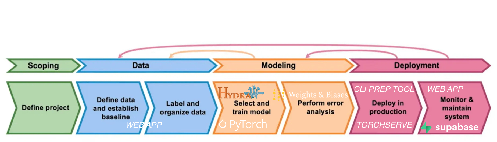
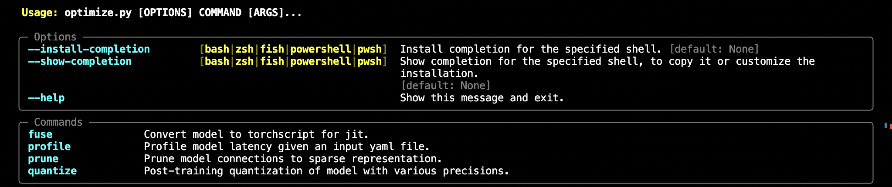

MLOps Lifecycle from Start to Finish
=================

Description
-----------------
This is an example of how a complete ML lifecycle could look like. The project 
provides most boilerplate code you would normally need to build from scratch in 
a new project. In an attempt to only use open-source and highly supported 
frameworks, I also integrated services which are easy to use and configure. For 
Machine Learning the codebase is implemented with standard PyTorch and easily 
extended for all types of problems. Configurations of experiments with models 
are centralized into the 
[Hydra](https://github.com/facebookresearch/hydra) framework, offering 
hierarchical organization of all parameters adjustable in training and 
evaluation. Outcomes of the experiments are automatically tracked with 
[Weights and Biases](https://wandb.ai/site), either locally or on your personal
projects page. Checkpoints of models are stored locally and can be used
after the modelling part is done for deployment. To enable deployment on edge
devices and scale I added a CLI for typical PyTorch deployment optimzations, 
offering performance profiling, pruning, quantization and fusion. The perpared
models are stored with all meta data in a model archive, ready for production.
Archived models can then be served as APIs, either individually or 
simultaniously. By the extensive opprtunities 
[TorchServe](https://pytorch.org/serve/getting_started.html) offers, we can also 
track production metrics on the backend, as well as manage which models to serve
when and how much computing power to deploy for each. To pave the way for 
people new to serving Machine Learning models, who do not want to learn the CLI
of TorchServe, I also implemented a backend web-app, to manage the serving 
process. The web-app comes with a user facing frontend where the model APIs are
usable, and admin pages for serving and active learning. Active learning is
based on new examples coming in through the frontend, which are annonynoumusly 
stored in a [Supabase](https://supabase.com/docs) bucket, together with the 
predictions from the model in a Postgresql database. Fortunatly we can use the 
[Supabase SDK](https://supabase.com/docs/reference/python/introduction) which 
enables easy usage.

As an example I also integrated openAI's [chatGPT](https://openai.com/chatgpt) 
into the frontend application together with the model APIs, using 
[streamlit](https://streamlit.io/), which is again accompanied by a 
configuration file controlling the app and administration rights.

If you want to learn more about the underlying services and steps, read my [blog](https://philippmoehl.github.io/)
post accompaniing the project.

Installation
---------------

### Setup
If you do not have used Weights and Biases before, you will be asked to choose
between three options when first executing the `./main.py` Python script, namely
you can decide between signing up to a free account to track experiments on the 
website, or if you have an account to sign in, or to track experiments only 
locally. I would recommend to sign up, as the account comes with visualizations
of all peerformance scores and additional analyitics.

For the use of the web app, you need to have a Supabase account and set up an
organization and a project for free. This will give you access to storages and 
databases. Here you need to specify your wanted 
[policies](https://supabase.com/docs/learn/auth-deep-dive/auth-policies). This
decides who has access to your database and storage. I used the policy to 
enable authenticated users to access both. However, I am also the only 
authenticated user and admin for the web-app. In the authentication area of 
your organization you can create and manage users. For more complex structures
you want a more sophisticated policy setup.

If you which to also integrate OpenAI into the frontend applicaotion as in the
example, you need can get your own 
[API Key](https://platform.openai.com/account/api-keys).

After you have done all these set ups, you can follow the steps and then start
configuring:

1. Clone the repository.

2. Install the necessary dependencies:

`> pip install -r requirements.txt`

### Configuration

Note that these steps are only nessecary if you want to use the web applcation.

1. Find the file named `.env.template` in the main folder. This file may
    be hidden by default in some operating systems due to the dot prefix.
2. Create a copy of `.env.template` and call it `.env`;
    if you're already in a command prompt/terminal window:
    
`> cp .env.template .env`.

3. Open the `.env` file in a text editor.
4. Find the line that says `OPENAI_API_KEY=`.
5. After the `=`, enter your unique OpenAI API Key *without any quotes or spaces*.
6. Find the lines that say `SUPABASE_URL=` and `SUPABASE_KEY=`.
7. After the `=`, enter your Supabse projects' credentials* *without any quotes or spaces*.
6. Find the lines that say `SUPABASE_MAIL=` and `SUPABASE_PSWD=`.
8. After the `=`, enter your Supabse authenticated users credentials** *without any quotes or spaces*.
9. Find the lines that say `ADMIN_USER=` and `ADMIN_PSWD=`.
10. After the `=`, enter the user credentials you want to use for the admin in the web application *without any quotes or spaces*.
11. Save and close the `.env` file.

*You can find the `SUPABASE_URL` and `SUPABASE_KEY` under
`supabase.com/dashboard/project/<SUPABASE_URL>/settings/api` in `URL` and 
`anon public`

**You can find the `SUPABASE_MAIL` and `SUPABASE_PSWD` from your created users
at `supabase.com/dashboard/project/<SUPABASE_URL>/auth/users/auth/users`

Usage
-----------------

### Configurations

1. Create your custom dataset if needed at `src/data.py`.
2. Create your custom PyTorch model if needed at `src/algorithms.py`.
3. Create any additional data augementation scripts if needed at `src/augmentation.py`.
4. Adapt the experiments wrapper if needed at `src/experiments.py`.
5. Add new metrices if needed at `src/utils.py`.
6. If needed adapt the prompt design or the OpenAI integration in `src/prompt_design.txt`.
7. Configure your experiments in the `/conf` folder. It would be best to make +
yourself first familiar with the Hydra framework. Find inspiration in the 
current example.
8. Adapt the applicaiton configurations in `/app_config.yaml`. Currently, it is [best 
practice](https://platform.openai.com/docs/guides/gpt) to use the "gpt-3.5-turbo" model, because of the cost and 
performance. If an increase in performance is required, "gpt-4" model can also be set. Note that
the [pricing](https://openai.com/pricing) of "gpt-4" is by far higher.

### Run
To run the experiments, execute:

`> python main.py`

Track your experiments with Weights and Biases.

To prepare the results for deployment, execute:

`python optimize.py --<command> <experiment_path> --<additonal_options_flag> <option>`

Here is an example: 

`python optimize.py --fuse ./results/vit/exp_0/royal-capybara-6_2023-10-20_19-27-12 --checkpoint 3`

To familairize yourself with the possibilities, please execute:

`python optimize.py --help`

To run the web applicaton, execute:

`streamlit run 1_🤖_app.py`

Refer to the gif at the start for usage of the application.

Disclaimer
---------------
Please note that the use of a GPT language model and text-to-image models can be expensive due to its token usage. By utilizing this project, 
you acknowledge that you are responsible for monitoring and managing your own token usage and the associated costs. It 
is highly recommended to check your OpenAI API usage regularly and set up any necessary limits or alerts to prevent unexpected charges.