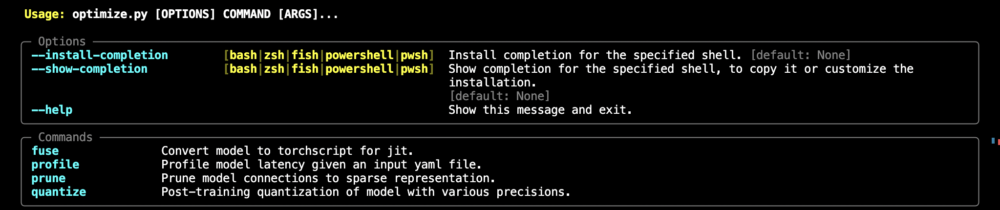

ml-lifecycle
=================

A PyTorch pipeline that takes a trained checkpoint to a served model. A CLI
profiles latency, size and accuracy, then applies TorchScript compilation,
post-training quantization (int8 / float16) and L1 pruning, and packages the
result as a [TorchServe](https://pytorch.org/serve/getting_started.html) model
archive. The archives are served through TorchServe, with model registration,
worker scaling and production metrics driven over its management API.

Training sits upstream of that: experiments are configured with
[Hydra](https://github.com/facebookresearch/hydra), tracked with
[Weights and Biases](https://wandb.ai/site), and checkpointed locally.
Downstream, an active-learning loop stores incoming production inputs and model
predictions so they can be relabeled and fed back into training.

Pipeline
-----------------

| Stage | What it does | Where |
| --- | --- | --- |
| Train | EfficientNet, ResNeXt and ViT image classifiers on a 39-class plant disease dataset. Hydra configs, W&B tracking. | `main.py`, `conf/`, `src/experiment.py` |
| Profile | Compares original, fused, quantized, fused + quantized and pruned variants on size, latency (avg / min / max) and accuracy. | `optimize.py profile` |
| Fuse | Compiles to TorchScript (`torch.jit.script`, or trace + `optimize_for_inference`). | `optimize.py fuse` |
| Quantize | Post-training dynamic quantization of linear layers to int8 or float16 on CPU, half precision on GPU. | `optimize.py quantize` |
| Prune | L1 unstructured pruning of Conv2d, Linear and LSTM weights. | `optimize.py prune` |
| Archive | Every optimized model is written as a `.mar` with its label map and a custom handler. | `src/optimize_utils.py`, `src/custom_handler.py` |
| Serve | Start and stop TorchServe, register models, set and scale workers, read metrics. | `src/app_utils.py`, `pages/2_*_serve.py` |
| Active learning | Production inputs go to a [Supabase](https://supabase.com/docs) bucket, predictions to Postgres, and an admin page relabels them. | `pages/3_*_label.py` |

Known limit: static (eager mode) quantization for the CNNs is not wired up yet,
so EfficientNet and ResNeXt fall back to dynamic quantization.

Web application
-----------------

The serving and labeling steps can also be driven from a
[Streamlit](https://streamlit.io/) app, for people who do not want to learn the
TorchServe CLI. It has a user-facing page that calls the model APIs, plus admin
pages for serving and labeling. As an example, the user-facing page also
integrates OpenAI's chat API alongside the model APIs.

More background on the services and steps is in the accompanying
[blog post](https://philippmoehl.github.io/).

Installation
---------------

### Setup
If you do not have used Weights and Biases before, you will be asked to choose
between three options when first executing the `./main.py` Python script, namely
you can decide between signing up to a free account to track experiments on the 
website, or if you have an account to sign in, or to track experiments only 
locally. I would recommend to sign up, as the account comes with visualizations
of all peerformance scores and additional analyitics.

For the use of the web app, you need to have a Supabase account and set up an
organization and a project for free. This will give you access to storages and 
databases. Here you need to specify your wanted 
[policies](https://supabase.com/docs/learn/auth-deep-dive/auth-policies). This
decides who has access to your database and storage. I used the policy to 
enable authenticated users to access both. However, I am also the only 
authenticated user and admin for the web-app. In the authentication area of 
your organization you can create and manage users. For more complex structures
you want a more sophisticated policy setup.

If you which to also integrate OpenAI into the frontend applicaotion as in the
example, you need can get your own 
[API Key](https://platform.openai.com/account/api-keys).

After you have done all these set ups, you can follow the steps and then start
configuring:

1. Clone the repository.

2. Install the necessary dependencies:

`> pip install -r requirements.txt`

### Configuration

Note that these steps are only nessecary if you want to use the web applcation.

1. Find the file named `.env.template` in the main folder. This file may
    be hidden by default in some operating systems due to the dot prefix.
2. Create a copy of `.env.template` and call it `.env`;
    if you're already in a command prompt/terminal window:
    
`> cp .env.template .env`.

3. Open the `.env` file in a text editor.
4. Find the line that says `OPENAI_API_KEY=`.
5. After the `=`, enter your unique OpenAI API Key *without any quotes or spaces*.
6. Find the lines that say `SUPABASE_URL=` and `SUPABASE_KEY=`.
7. After the `=`, enter your Supabse projects' credentials* *without any quotes or spaces*.
6. Find the lines that say `SUPABASE_MAIL=` and `SUPABASE_PSWD=`.
8. After the `=`, enter your Supabse authenticated users credentials** *without any quotes or spaces*.
9. Find the lines that say `ADMIN_USER=` and `ADMIN_PSWD=`.
10. After the `=`, enter the user credentials you want to use for the admin in the web application *without any quotes or spaces*.
11. Save and close the `.env` file.

*You can find the `SUPABASE_URL` and `SUPABASE_KEY` under
`supabase.com/dashboard/project/<SUPABASE_URL>/settings/api` in `URL` and 
`anon public`

**You can find the `SUPABASE_MAIL` and `SUPABASE_PSWD` from your created users
at `supabase.com/dashboard/project/<SUPABASE_URL>/auth/users/auth/users`

Usage
-----------------

### Configurations

1. Create your custom dataset if needed at `src/data.py`.
2. Create your custom PyTorch model if needed at `src/algorithms.py`.
3. Create any additional data augementation scripts if needed at `src/augmentation.py`.
4. Adapt the experiments wrapper if needed at `src/experiments.py`.
5. Add new metrices if needed at `src/utils.py`.
6. If needed adapt the prompt design or the OpenAI integration in `src/prompt_design.txt`.
7. Configure your experiments in the `/conf` folder. It would be best to make +
yourself first familiar with the Hydra framework. Find inspiration in the 
current example.
8. Adapt the applicaiton configurations in `/app_config.yaml`. Currently, it is [best 
practice](https://platform.openai.com/docs/guides/gpt) to use the "gpt-3.5-turbo" model, because of the cost and 
performance. If an increase in performance is required, "gpt-4" model can also be set. Note that
the [pricing](https://openai.com/pricing) of "gpt-4" is by far higher.

### Run
To run the experiments, execute:

`> python main.py`

Track your experiments with Weights and Biases.

To prepare the results for deployment, execute:

`python optimize.py <command> <experiment_path> --<additional_option> <value>`

The commands are `profile`, `fuse`, `quantize` and `prune`. Here is an example:

`python optimize.py fuse ./results/vit/exp_0/royal-capybara-6_2023-10-20_19-27-12 --checkpoint 3`

To familairize yourself with the possibilities, please execute:

`python optimize.py --help`

To run the web applicaton, execute:

`streamlit run 1_🤖_app.py`

Refer to the gif at the start for usage of the application.

Disclaimer
---------------
Please note that the use of a GPT language model and text-to-image models can be expensive due to its token usage. By utilizing this project, 
you acknowledge that you are responsible for monitoring and managing your own token usage and the associated costs. It 
is highly recommended to check your OpenAI API usage regularly and set up any necessary limits or alerts to prevent unexpected charges.